注 1：为避免侵权，GitHub 未上传 assets、musics 等内容，tools 中的 wchisp.exe 与 usb_driver 需自行获取。

注 2：打包版因包含上述内容，也不会上传 GitHub，如有需要请自行下载。

打包版下载：
https://wwatd.lanzoup.com/b00oduvcxa
密码:9fw5

# NS Auto Painter使用指南

## 📦 软件包结构与启动

##### 1️⃣解压即用

   下载 `NSAutoPainterAPP.zip` 并解压到任意文件夹。确保 `_internal`文件夹与 `NSAutoPainterAPP.exe` 在同一目录。

##### 2️⃣启动程序

   双击 `NSAutoPainterAPP.exe`，弹出启动画面，请仔细阅读免责声明与开源许可说明。点击 **「我已知晓，进入主界面」** 即可进入工具选择页。

> 💡 **提示：必须保持 exe 与资源文件夹在同一目录。**

## 📖预备知识

### 单片机

#### 型号

`CH32F103C8T6`双TypeC口开发版（无需焊接），需自行购买，图片价格仅供参考。

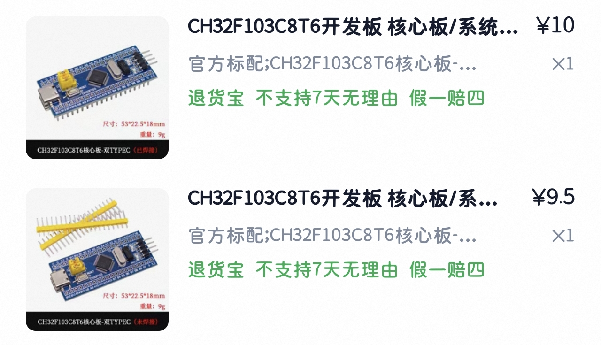

#### RESET 按钮

复位键，可以看作是重启键，软件使用出现问题时（如连接失败，识别不到等情况）可以尝试按下 RESET 按钮复位。

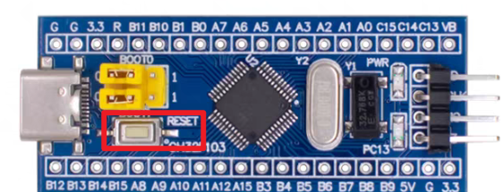

#### HUSB 接口

USB 主机接口，用于连接 PC。

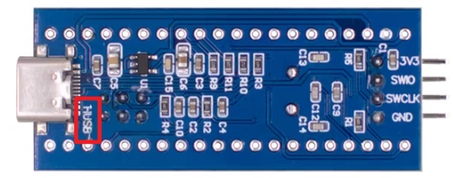

#### BootLoader 烧录模式

断开全部 USB 连接，将 BOOT0 的跳线帽拔掉置为下图状态后接入 USB，按下 RESET。

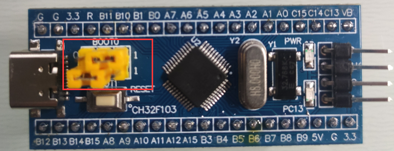

#### 正常模式

断开全部 USB 连接，将 BOOT0 的跳线帽拔掉置为下图状态后接入 USB。

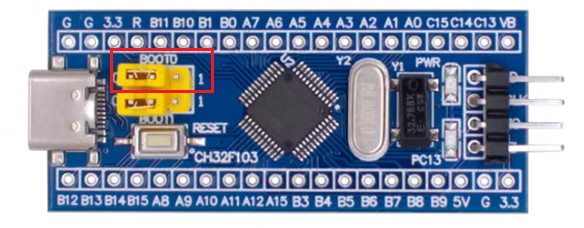

### 软排线

因 USB 口紧凑设计，建议搭配购买 2 根 TypeC 软排线（公转母）。

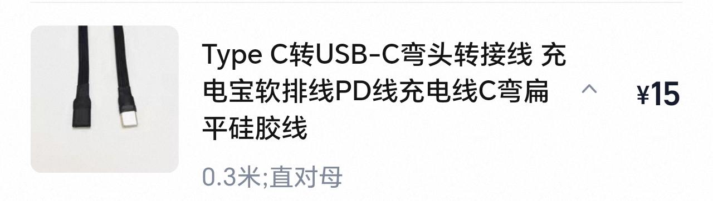

此外如果需要直连 NS 而非接入底座模式，可能需要额外购买 TypeC 转 USBA 母头。

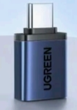

### 连接示意图

NS 端无法使用 C to C，因此要么接底座要么使用转换器或其他相近方案。

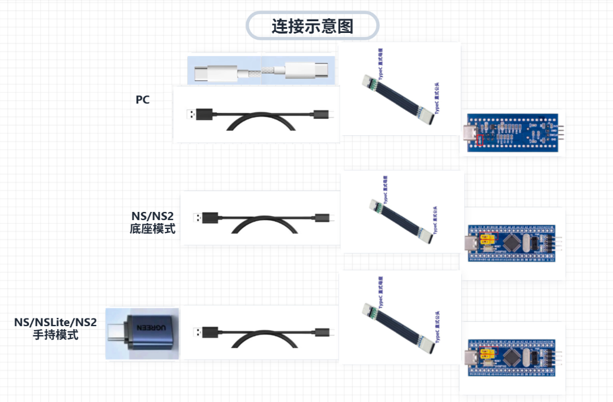

> ⚠**本文提到的硬件，价格仅供参考，自行选择合适的购买即可。**
>
> 目前淘宝看到的`CH32F103C8T6`最低价 8 元/块，软排线最低价 6 元/根，TypeC 转 USBA 母头最低价 4 元/个。

## 🛠工具介绍

### 🎮 模拟手柄

此工具用于连接单片机，模拟 NS PRO 手柄与 NS 配对，并执行绘图任务。

点击**「模拟手柄」**进入页面，初次使用请按照以下流程。

---

#### 烧录固件（首次使用必须执行）

新单片机出厂时内部无程序，需先烧录伊机控开源固件。

##### 1️⃣ 根据软件指引进入 BootLoader 烧录模式，此时只接 PC，NS 暂不连接

##### 2️⃣ 驱动安装（仅首次需要）

- 首次连接，点击**「开始检测」**，程序会提示缺少驱动。点击**「安装驱动」**（需管理员权限），程序将自动导入证书并安装 WinUSB 驱动。
- 安装完成后，点击单片机上的 RESET 按钮，点击软件页面的**「重新检测」**。

##### 3️⃣ 烧录固件

1. 上一步点击**「重新检测」**后程序将自动识别 BootLoader 模式并提示“是否烧录固件”。
2. 点击**「开始烧录」**，等待进度条完成。
3. 烧录成功后，点击确认按钮返回**「开始检测」**页面，**断开 USB 电源**，将单片机恢复为正常模式后重新接入。

---

#### 连接单片机（完成首次烧录，此后使用可直接跳到此步）

##### 1️⃣ 设备连接准备

1. 将单片机 **HUSB 接口**通过 USB 线连接电脑。
2. 将单片机另一 USB 口连接 **Switch 底座**，手持模式的连接方式参考**连接示意图**。
3. 确保单片机处于正常模式。

##### 2️⃣ 点击「开始检测」，通过检测后点击「自动连接」，出现庆祝画面即连接成功，连接失败按RESET后重试

##### 3️⃣ 点击手柄图标区域进入虚拟手柄页面，各功能模块说明如下

| 功能         | 说明                                                         |
| ------------ | ------------------------------------------------------------ |
| **手动测试** | 点击按钮或按下键盘映射键，激活手柄连接。                     |
| **自动测试** | 开发测试用，无需理会。                                       |
| **按键映射** | 自定义键盘按键对应手柄按键，支持多套配置管理与切换。         |
| **按键计数** | 开发测试用，无需理会。                                       |
| **重新检测** | 单片机在此页面断开连接时，可点击**「重新检测」**重新完成连接流程。 |
| **时序参数** | 控制绘制按键级操作的时间间隔，可自行测试，正常使用不建议调整。 |
| **停止绘图** | 进入绘图后用于打断绘图任务。                                 |
| **恢复绘图** | 可以从最近的一次中断恢复，支持**「从暂停恢复」**（中断后未操作 NS）与**「从保存恢复」**（临时保存重新打开）。 |

---

### 🎨 朋友收集

此工具用于处理图片数据，包括像素化、导入 JSON 等

点击**「朋友收集」**进入页面。

#### 🌐打开第三方像素化网页

##### 1️⃣ 点击对应按钮跳转到浏览器页面

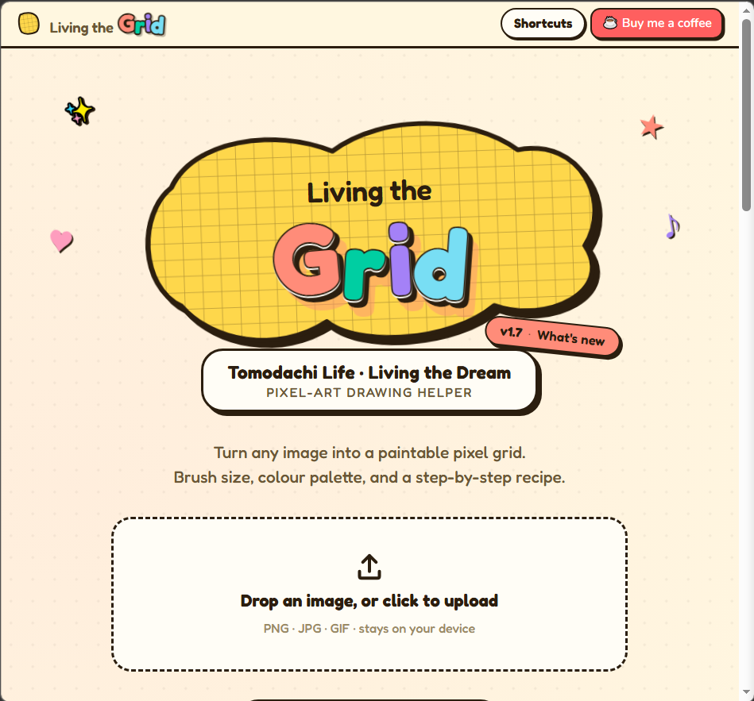

##### 2️⃣ 上传带有透明背景的 PNG 图片后，在像素化选项中可以调节生成图片的

- 画幅
- 画笔类型（Pixel 像素画笔[推荐]、Smooth 顺滑画笔）
- 笔尖大小（4px[推荐]、8px、16px、32px、1px、3px、7px、13px、19px、27px）
- 最大色彩（2-32）
- 调色盘类型（Game 预设色彩[推荐]、Auto 自定义、其他实现已归入 Auto）

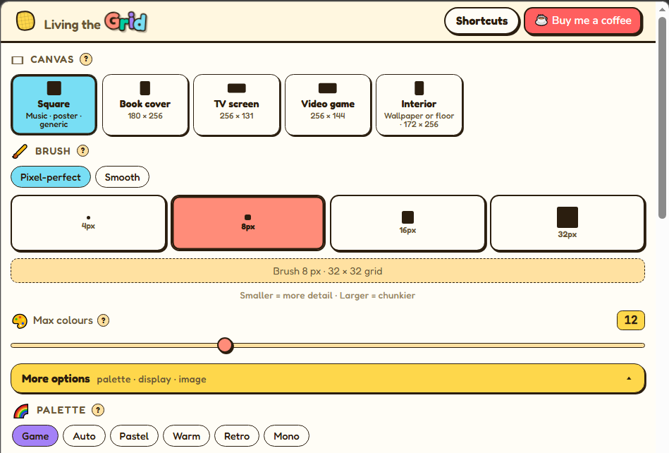

##### 3️⃣ 完成后点击下载 JSON 格式的文件

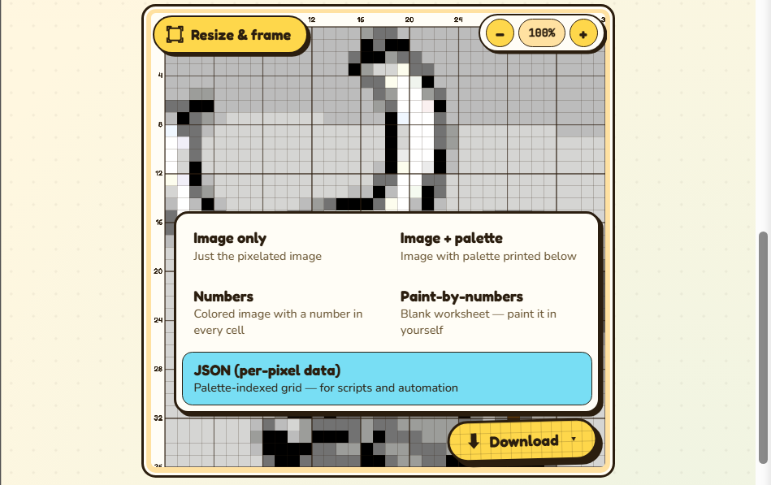

#### 📄 导入第三方 JSON 像素画

##### 1️⃣ 在右侧「JSON 导入」区域点击「上传 JSON」，选择文件

##### 2️⃣ 上传后软件会自动选择画笔类型和笔尖大小
##### 3️⃣ 点击「渲染 JSON」，确认预览区显示效果符合预期
##### 4️⃣ 点击「定稿」，计算最佳路径与耗时

##### 5️⃣ 确认执行后页面将跳转到模拟手柄工具页并开始执行绘制任务（请确保进入画布后未操作 NS）

---

## ⚙️ 配置与工具箱

### 按键映射管理

大家应该用不到，鼠标点击就够用了。

在模拟手柄页点击 **「按键映射」** → **「管理配置」**，可对已有配置进行重命名、激活、删除等操作。所有修改需点击 **「应用」** 生效。

### 图片工具箱

应该也没啥用。

- **格式转换**：支持将本地图片批量转换为 PNG/JPEG/WEBP 等格式，可自定义质量。
- **ICO 多尺寸**：勾选所需分辨率，一键生成 Windows 图标。

---

## 🗃 右键点击边框栏

### 关于——查看软件基本信息

### 联系作者——查看作者联系方式

### 请作者喝咖啡——狠狠地打赏作者

## 📜 免责与开源声明

本软件为个人学习交流项目，**非任天堂官方产品**，仅供技术研究使用。使用者需自行承担因使用本软件而产生的一切后果。软件集成了多个开源项目，详情请见启动画面的「开源声明」部分。感谢所有开源贡献者！